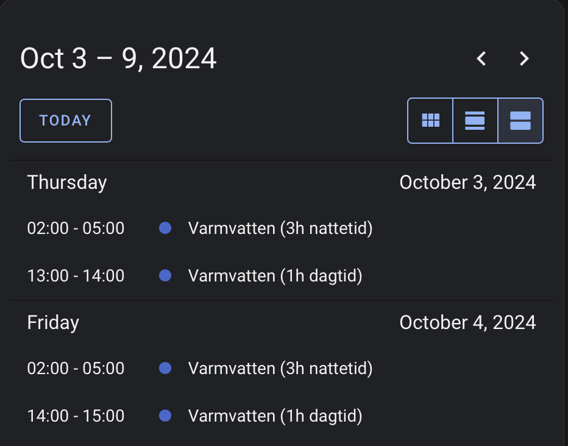
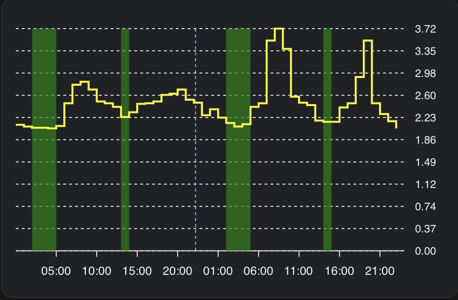

# Cheapest hours blueprints
This is a repackage of the Cheapest Hours Non-sequential by [Toni Korhonen](https://www.creatingsmarthome.com/index.php/2023/11/12/home-assistant-advanced-nord-pool-cheapest-hours-automation-non-sequential/). The core logic has remained untouched, but automations and sensors have been moved into blueprints to make it easier to have multiple entites to control.

The automations are based on electricity prices from the [Nordpool](https://github.com/custom-components/nordpool) integration.

The automations can be used to turn anything on or off depending on the electricity price, for example a boiler, fan or heater. It will find the cheapest non sequential hours in a defined time span.

## Installation
1. Create a [Local calendar](https://www.home-assistant.io/integrations/local_calendar/). This will be used to schedule the Cheapest Hours automations. It is possible to use one calendar for all, or multiple for different use cases.
2. Download the two blueprints into Home Assistant. Use buttons below. [Guide](https://www.home-assistant.io/docs/automation/using_blueprints/#importing-blueprints). 
3. Setup automations from the blueprints. There will be one "Schedule calendar events" automation per entity you want to contral, and one "Calendar trigger" automation per calendar you created in 2.
The documentation in the blueprints should be enough get everything up and running.

#### Blueprint 1 - Schedule calendar events
[](https://my.home-assistant.io/redirect/blueprint_import/?blueprint_url=https%3A%2F%2Fgithub.com%2Ftorbjorn2000%2Fcheapest-hours-blueprints%2Fblob%2Fmain%2Fblueprints%2Fcheapest_hours_schedule_calendar_events.yaml)

#### Blueprint 2 - Schedule calendar events
[](https://my.home-assistant.io/redirect/blueprint_import/?blueprint_url=https%3A%2F%2Fgithub.com%2Ftorbjorn2000%2Fcheapest-hours-blueprints%2Fblob%2Fmain%2Fblueprints%2Fcheapest_hours_calendar_trigger.yaml)

## How it works
The process consistst of one automation that calculates the cheapest hours and creates calendar events for them, and a second automation triggering on these calendar events and flips a switch on or off.

The first blueprint is the one you configure with the time span, how many hours to find, and which entity to flip on and off. You can make as many automations as you want from this blueprint, having differernt schedules (night and day) or different entities.

One calendar is enough, to be shared among all automations, but more can be created if you find that better.

Each created automation (still talking about the first blueprint) will have a `calendar_summary` as a key for the calendar event. This is what makes it possible to share the calendar.

The calendar events for the following day are created when the Nordpool sensor gets the prices for tomorrow. If this fails for some reason, there is a failsafe path that turns on the entity at a certain hour.

For more details on the core logic, or ideas what to use it for, please check out the [original solution](https://www.creatingsmarthome.com/index.php/2023/11/12/home-assistant-advanced-nord-pool-cheapest-hours-automation-non-sequential/), the one deserving all cred for this.

## Nice to have utils

### Calendar card




```yaml
type: calendar
initial_view: listWeek
entities:
  - calendar.electricity
```

### ApexCharts visualization


Using [ApexCharts](https://github.com/RomRider/apexcharts-card), the schedule can be visualized in a graph. In the above example, green areas signals when the entity is scheduled to turn on, and the yellow line is the electricity price.

The past events (when the switch entity was turned on and off) are not from the calendar but from the entity itself. 

for the electricity price, I have a custom sensor  combining historical and future prices.

#### First, create a sensor with the calendar events
To fetch the calendar events, a trigger-based template sensor is used (the calendar entity does not have the data in its state).

```yaml
template:
  - trigger:
    - platform: homeassistant
      event: start
    - platform: time_pattern
      hours: "/1"
    # Would be a good idea to trigger on the automation setting the calendar events
    action:
      action: calendar.get_events
      data:
        start_date_time: "{{ today_at() + timedelta(hours=2) }}"
        end_date_time: "{{ today_at() + timedelta(days=2) }}"
      target:
        entity_id: calendar.electricity
      response_variable: events
    sensor:
    - name: "Cheapest hours events"
      unique_id: 49bf26c6-bd46-4667-b88a-8ae4e0e4c957
      icon: mdi:calendar-star
      state: "{{ events['calendar.electricity'].events | count }}"
      attributes:
        events: "{{ events['calendar.electricity'].events }}"
```

#### Then, add the series to the chart
Using the sensor in the ApexCharts. The filter can be customized to only show certain automations.
```yaml
  - entity: sensor.cheapest_hours_events
    data_generator: >
      return entity.attributes.events  .filter(({ end }) => new Date(end) > new
      Date()) .filter(({ summary }) => summary.startsWith("Varmvatten")) 
      .flatMap(({
        start, end }) => [
          [new Date(start).getTime(), 1],
          [new Date(end).getTime(), 0]
        ]);
    type: area
    stroke_width: 0
    color: green
    curve: stepline
```

#### Full ApexCharts config (example)

```yaml
type: custom:apexcharts-card
header:
  show: true
now:
  show: true
graph_span: 2d
span:
  start: day
apex_config:
  legend:
    show: false
yaxis:
  - id: price
    show: true
    opposite: true
    decimals: 2
    min: 0
    apex_config:
      forceNiceScale: true
  - id: cheapest_hours
    max: 1
    show: false
series:
  - entity: switch.heater_water_production_enabled
    type: area
    yaxis_id: cheapest_hours
    curve: stepline
    color: green
    stroke_width: 0
    transform: "return x === 'on' ? 1 : 0;"
  - entity: sensor.cheapest_hours_events
    data_generator: >
      return entity.attributes.events  .filter(({ end }) => new Date(end) > new
      Date()) .filter(({ summary }) => summary.startsWith("Varmvatten")) 
      .flatMap(({
        start, end }) => [
          [new Date(start).getTime(), 1],
          [new Date(end).getTime(), 0]
        ]);
    type: area
    stroke_width: 0
    color: green
    curve: stepline
    yaxis_id: cheapest_hours
  - entity: sensor.electricity_price
    yaxis_id: price
    extend_to: false
    name: Pris
    curve: stepline
    stroke_width: 2
    color: "#FAF607"
    data_generator: |
      return entity.attributes.prices.map((entry) => {
        return [new Date(entry.start), entry.price];
      });

```